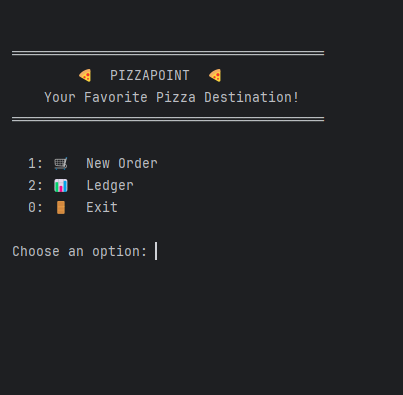
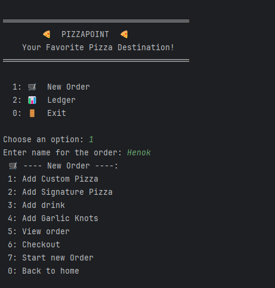
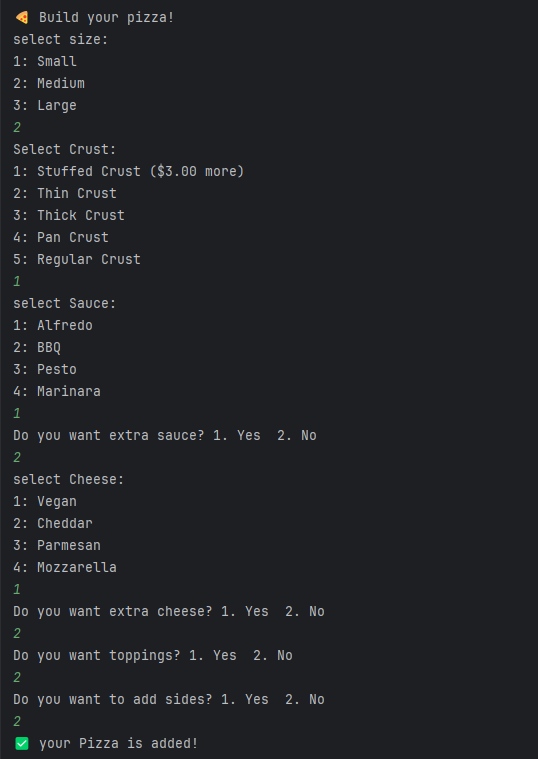
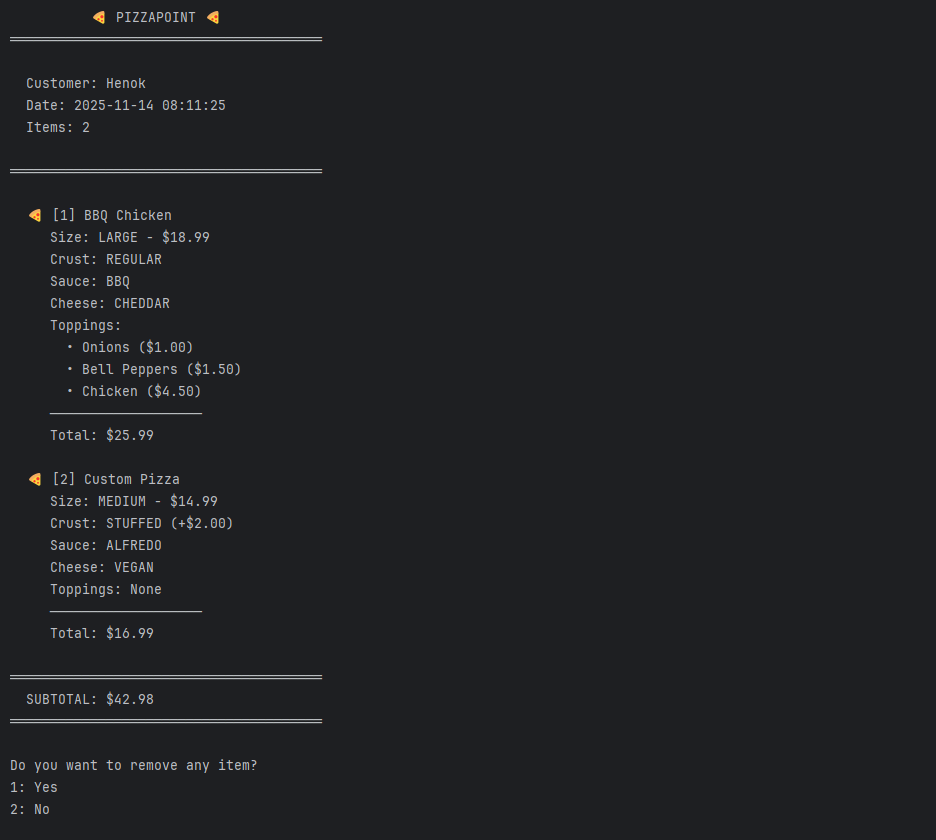
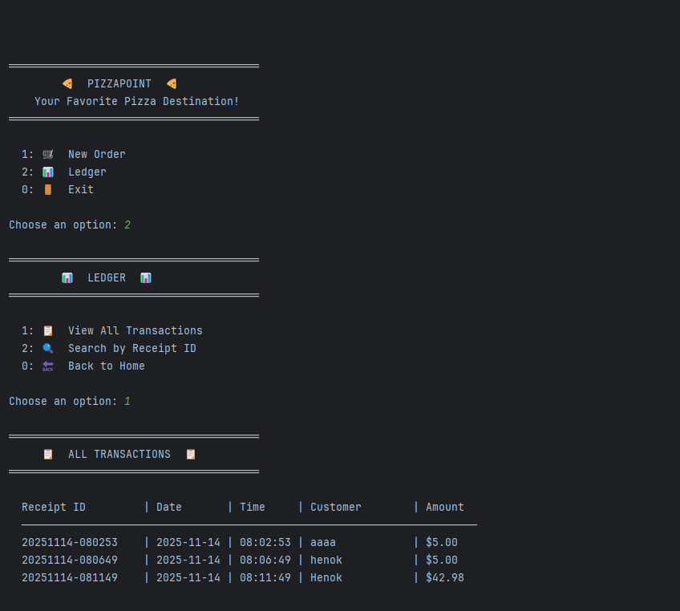

# 🍕 PizzaPoint - Pizza Ordering System

A feature-rich Java console application for managing pizza orders with full customization, payment processing, and transaction tracking.

## 📋 Table of Contents
- [Features](#-features)
- [Screenshots](#-screenshots)
- [Architecture](#-architecture)
- [OOP Concepts Used](#-oop-concepts-used)
- [Favorite Code Snippet](#-favorite-code-snippet)
- [Tech Stack](#-tech-stack)
- [Getting Started](#-getting-started)
- [Usage](#-usage)

## ✨ Features

### 🍕 Order Management
- **Custom Pizza Builder** - Create pizzas with customizable size, crust, sauce, cheese, and unlimited toppings
- **Signature Pizzas** - Pre-designed templates (Meat Lovers, Veggie Supreme, Hawaiian, BBQ Chicken, Margherita)
- **Customizable Signature Pizzas** - Modify any signature pizza by changing crust, sauce, or toppings
- **Drinks & Sides** - Add drinks with multiple sizes and free sides (Parmesan, pepper flakes)
- **Garlic Knots** - Additional menu item option
- **Order Preview** - View and modify cart before checkout
- **Item Removal** - Remove items from order before finalizing

### 💳 Payment & Receipts
- **Dual Payment Methods** - Cash (with change calculation) and card (NOT functional yet Just card validation for correct input )
- **Receipt Generation** - Detailed receipts with customer name, timestamp, and itemized pricing
- **Receipt Persistence** - Auto-saves to `receipts/` directory with unique IDs
- **Transaction Logging** - Tracks all orders in `transactions.csv` with pipe-delimited format

### 📊 Ledger System
- **View All Transactions** - Display complete transaction history in formatted table
- **Search by Receipt ID** - Quick lookup by entering receipt number
- **CSV Export** - All transactions stored for analysis

### 🔧 Technical Features
- **Dynamic Pricing** - Topping prices adjust based on pizza size (1.0x, 1.5x, 2.0x multipliers)
- **Input Validation** - Comprehensive validation for all user inputs
- **Generic Customization System** - Flexible architecture for single or multiple selections
- **Builder Pattern** - Pizza construction with fluent interface
- **Factory Pattern** - Signature pizza creation

## 📸 Screenshots

### Home Screen


### New Order Menu


### Custom Pizza Builder


### Order Preview


### Ledger System


## 🏗 Architecture

### UML Class Diagram


## 🎯 OOP Concepts Used

### Inheritance
- **MenuItem** abstract class extended by `Pizza`, `Drink`, `GarlicKnots`
- **SignaturePizza** extends `Pizza` for specialized pizzas

### Interfaces
- **Orderable** - Contract for items that can be ordered and priced
- **Customizable<T>** - Generic interface for customizable items

### Polymorphism
- Order stores `List<Orderable>` allowing any menu item type
- Receipt handles different item types polymorphically

### Encapsulation
- Private fields with public getters/setters
- Validation logic encapsulated in `InputHandler`
- Business logic separated into service classes

### Abstraction
- Abstract `MenuItem` class defines common behavior
- Interfaces hide implementation details

### Composition
- Pizza **has-a** list of toppings, sides, and customizations
- Order **has-a** list of orderable items

### Generics
- `Customization<T>` works with any type (toppings, sizes, crusts)
- `Customizable<T>` interface for type-safe customization

### Enums
- Type-safe constants with behavior (pricing methods)
- `PizzaSize`, `CrustType`, `SauceType`, `CheeseType`, `DrinkSize`, `ToppingCategory`

### Design Patterns
- **Builder Pattern** - `PizzaBuilder` for pizza construction
- **Factory Pattern** - `SignaturePizzaMenu` creates signature pizzas
- **Singleton Pattern** - Static `InputHandler` scanner

## 💎 Favorite Code Snippet

This elegant solution in `Customization.java` handles both single-choice options (like pizza size) and multi-choice options (like toppings) with a simple boolean flag:

```java
// Adds option: replaces if single-choice, increments count if multiple allowed
@Override
public void add(T option) {
    if (singleChoice) {
        options.clear();
        options.put(option, 1);
    } else {
        options.put(option, options.getOrDefault(option, 0) + 1);
    }
}

// Decrements option count or removes entirely if count is 1
@Override
public void remove(T option) {
    if (!options.containsKey(option)) return;
    int count = options.get(option);
    if (count <= 1) options.remove(option);
    else options.put(option, count - 1);
}
```

**Why I love this code:**
- Uses **generics** for type flexibility
- Single class handles two different behaviors (single vs. multiple selection)
- Clean **Map** usage with `getOrDefault()` for concise logic
- Properly manages item quantities (add multiple toppings, remove one at a time)
- Demonstrates **composition over inheritance**

## 🛠 Tech Stack

- **Language:** Java 17+
- **Build Tool:** Maven
- **Testing:** JUnit 5
- **File I/O:** Java NIO for receipts and CSV logging
- **Architecture:** MVC-inspired with UI, Services, and Domain layers

## 🚀 Getting Started

## 📖 Usage

### Main Menu
1. **New Order** - Start building your order
2. **Ledger** - View transaction history or search receipts
0. **Exit** - Close application

### Building an Order
1. Choose from custom pizza, signature pizza, drinks, or garlic knots
2. Customize your selections
3. Preview order and remove items if needed
4. Proceed to checkout

### Payment
- **Cash** - Enter amount tendered, receive change calculation
- **Card** - Enter card details (number, expiry, CVV, cardholder name)

### Receipt & Transactions
- Receipts saved to `receipts/` folder with timestamp ID format: `YYYYMMDD-HHMMSS`
- All transactions logged to `transactions.csv` with format: `ReceiptID|Date|Time|Customer|Amount`


## 🤝 Contributing

1. Fork the repository
2. Create a feature branch (`git checkout -b feature/AmazingFeature`)
3. Commit changes (`git commit -m 'Add some AmazingFeature'`)
4. Push to branch (`git push origin feature/AmazingFeature`)
5. Open a Pull Request

## 📄 License

This project is open source and available for educational purposes.

## 👤 Author

**lol0chx**
- GitHub: [@lol0chx](https://github.com/lol0chx)
- Repository: [Pizza-Point](https://github.com/lol0chx/Pizza-Point)

---

⭐ **Star this repo if you find it helpful!**
